# MarketPeak E-Commerce Website

MarketPeak is a responsive e-commerce website built with the Waso Strategy HTML template. It features a homepage, about us, and contact page, with project listings, a shopping cart, and user authentication capabilities. The platform is version-controlled with Git, deployed on an AWS EC2 Linux instance, and follows a CI/CD development workflow.

## Project Structure
marketpeak_Ecommerce/
│
├── css
├── fonts
├── images
├── img
├── js/
├── index.html
├── project-detail.html
├── README.md
└── .git

## 🚀 Features

Home, About, and Contact pages
Project listing
Shopping cart (frontend demo)
Git version control
AWS EC2 deployment (Apache)
CI/CD workflow (development → main → deploy)
Troubleshooting fixes

## 🛠️ Tools & Technologies

Git & GitHub
HTML5, CSS3, JavaScript
AWS EC2 (Amazon Linux 2)
Apache HTTP Server (httpd)
Linux CLI
VS Code

## 🧱 1. Project Setup

🔸 Download & Prepare Template
Download the Waso Strategy template from tooplate.com.
Unzip into a folder: marketpeak_ecommerce.
Open in VS Code.

## 🔸 Initialize Git & Commit Template
cd marketpeak_Ecommerce
git init
git add .
git commit -m "Initial commit: Add MarketPeak template files"

## 🔸 Push to GitHub
git remote add origin https://github.com/FIDMANN-TECH/marketpeak_Ecommerce.git
git push -u origin main

##  2. AWS EC2 Deployment

🔸 Launch EC2 Instance
OS: Amazon Linux 2
Open port 80 in the Security Group (IMPORTANT)
Generate .pem key for SSH access

## 🔸 Connect to EC2

## 🔸 Install Git & Apache
sudo yum update -y
sudo yum install git httpd -y

## 🔸 Clone Your Project
git clone https://github.com/FIDMANN-TECH/marketpeak_ecommerce.git
cd marketpeak_Ecommerce

## 🔁 . Deploying New Changes to EC2
SSH into EC2 and Pull Latest Code
sudo git pull origin main
sudo systemctl reload httpd

## 🔸 Move Files to Web Directory
🛑 Issue Faced:After copying files, accessing the site via browser returned the Apache test page or 403 error.✅ Fix: Confirmed that HTTP (port 80) was open in the EC2 Security Group and restarted Apache.
sudo systemctl reload httpd

## 🔄 4. Continuous Integration / CI-CD Workflow

## A. Create Development Branch
git checkout -b development

## B. Make Changes (e.g., Update index.html)

<strong>Address:</strong> 25 Allen Avenue, Ikeja, Lagos, Nigeria

<strong>Phone:</strong> +234 8038783362

## C. Stage, Commit & Push
git add index.html
git commit -m "Updated contact page with new Lagos address and phone"
git push origin development

## D. Create Pull Request

Go to GitHub → New Pull Request → From dev-contact → main
Review and merge.

## 🔐  Fixing File Permission Issues
🛑 Issue Faced:After updating files (e.g. index.html), changes were not visible on the live site.
✅ Fix: Changed ownership/permissions of the /var/www/html/ directory to ensure Apache could read the files.
sudo chmod -R 755 /var/www/html/
sudo chown -R apache:apache /var/www/html/

## 🧪 6. Testing

Open browser and navigate to:(http://52.22.69.143)
Confirm:
New contact page content visible
Images load properly
Navigation works

## Below are screenshots of workflow:

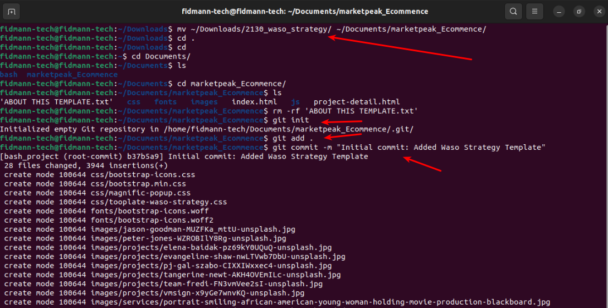

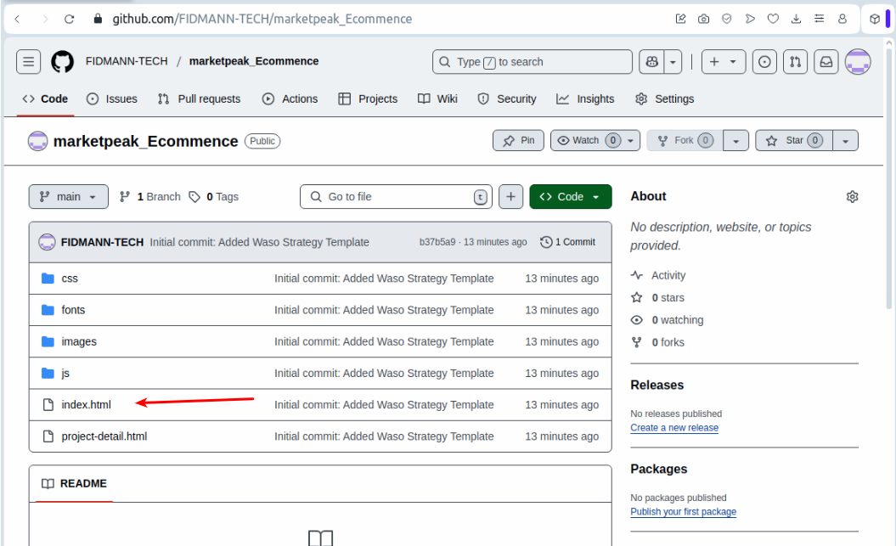
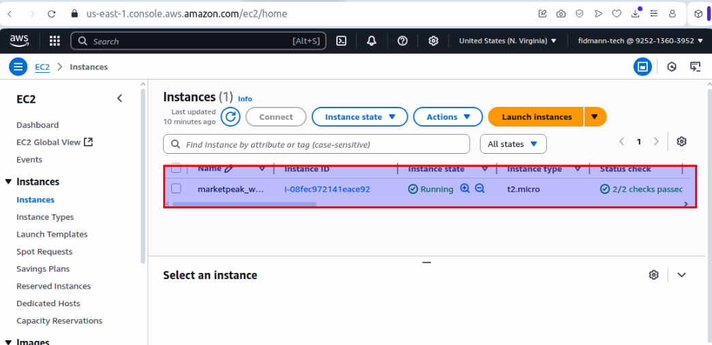
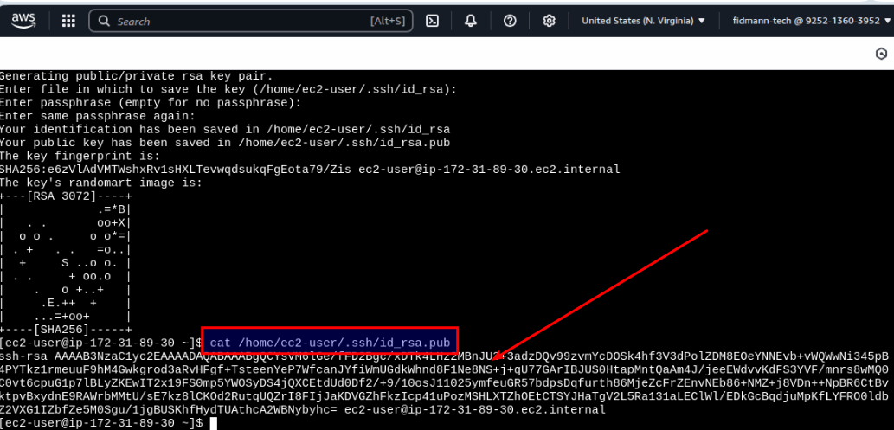
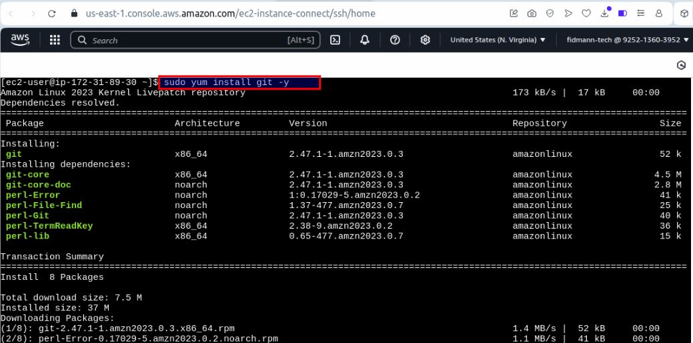

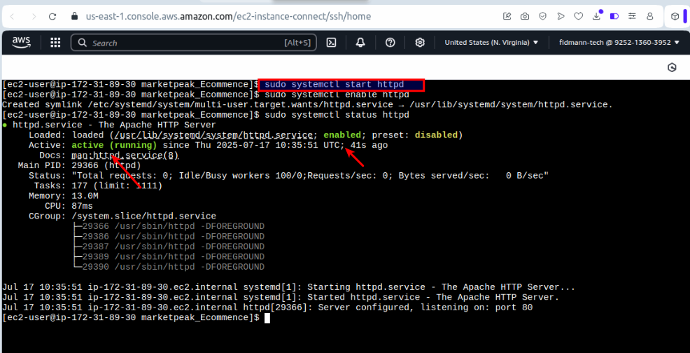
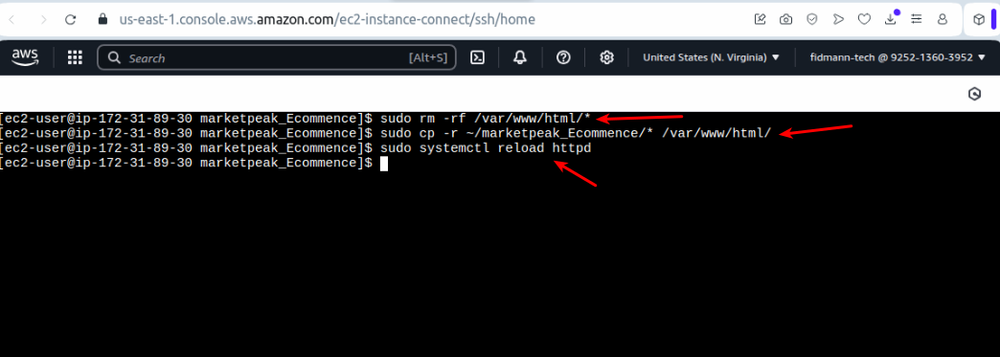
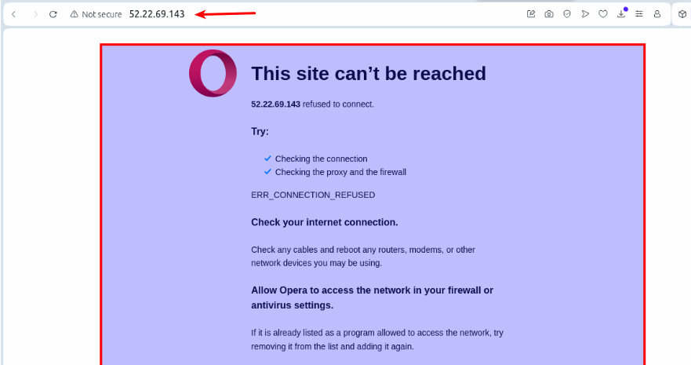
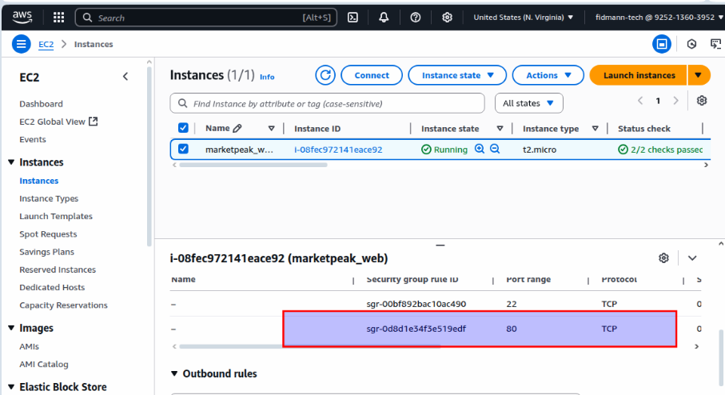
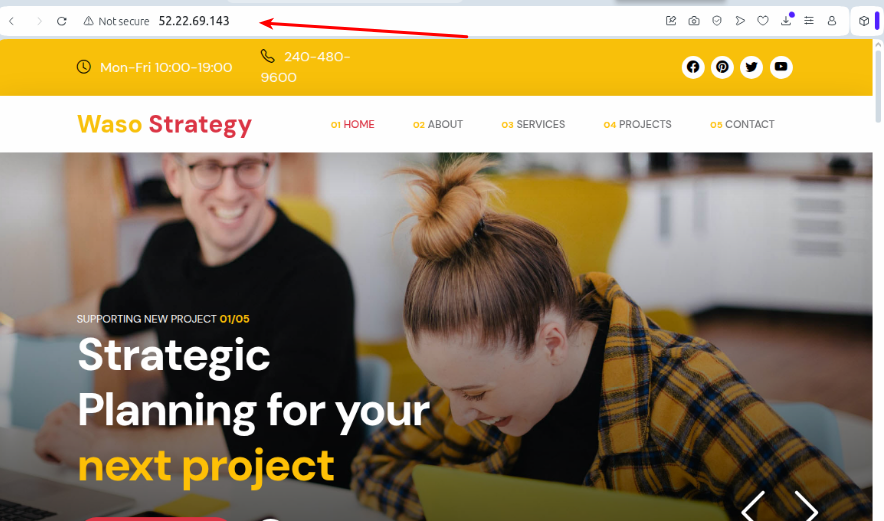
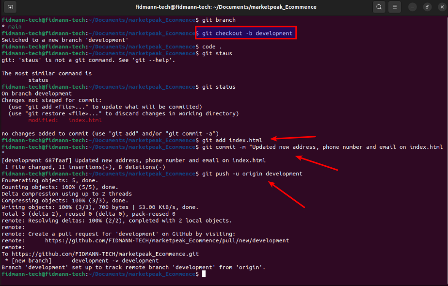

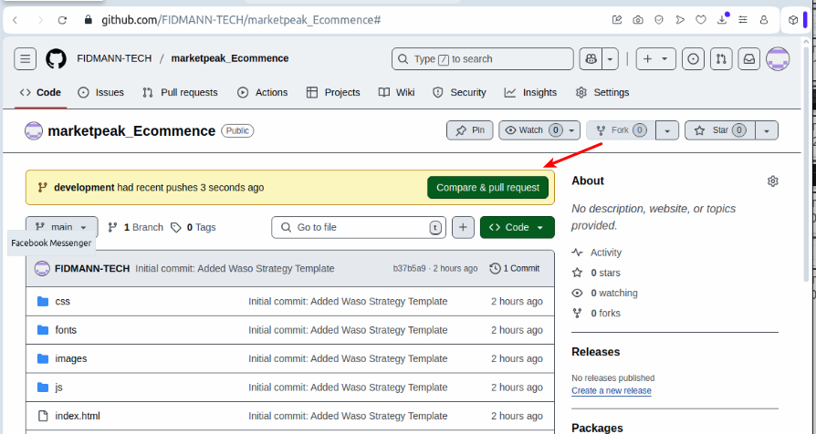
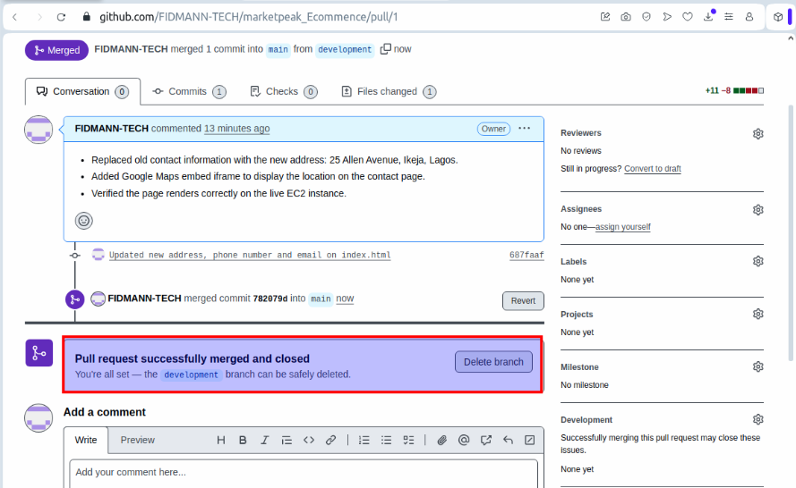
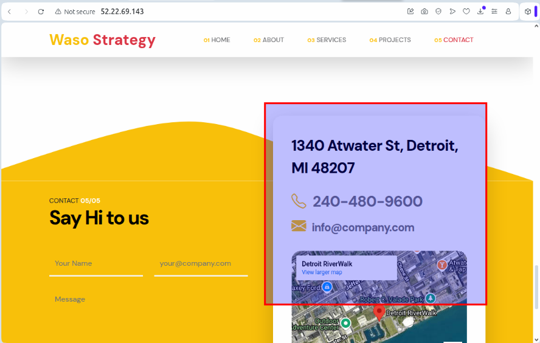
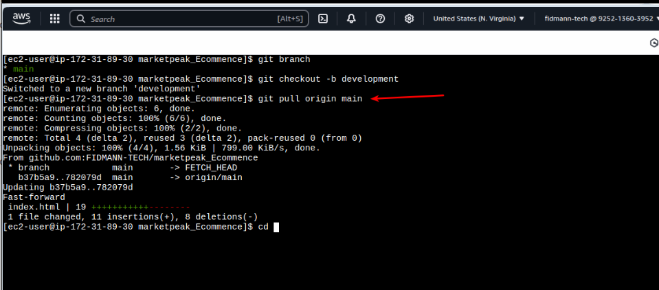
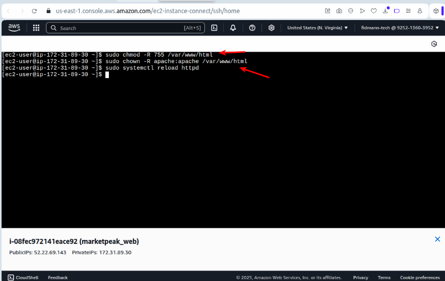

